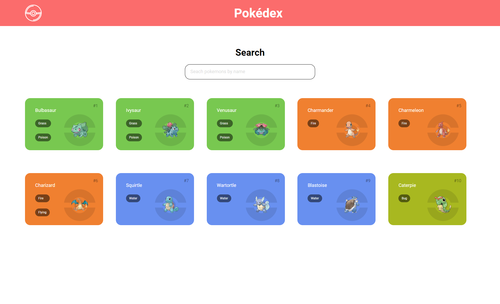
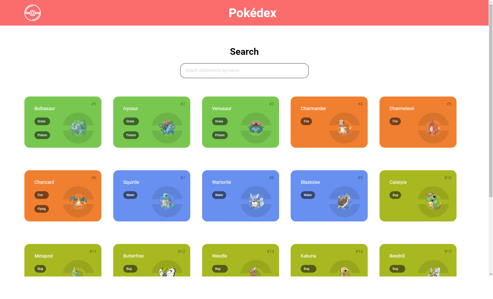
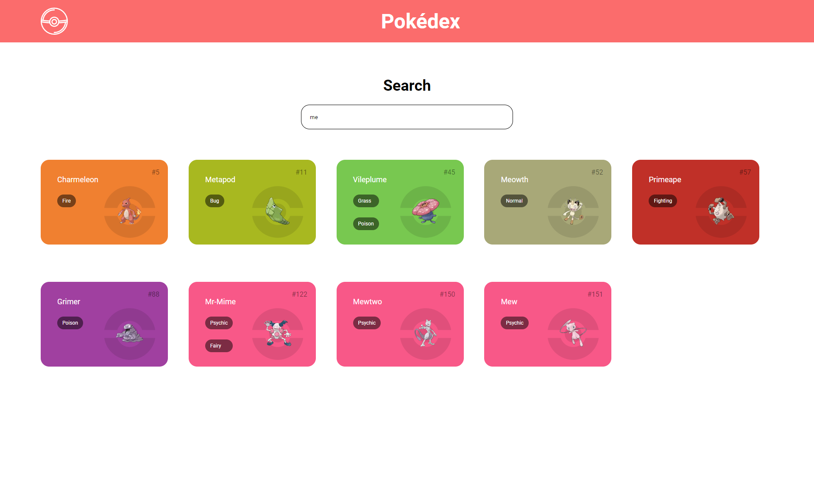
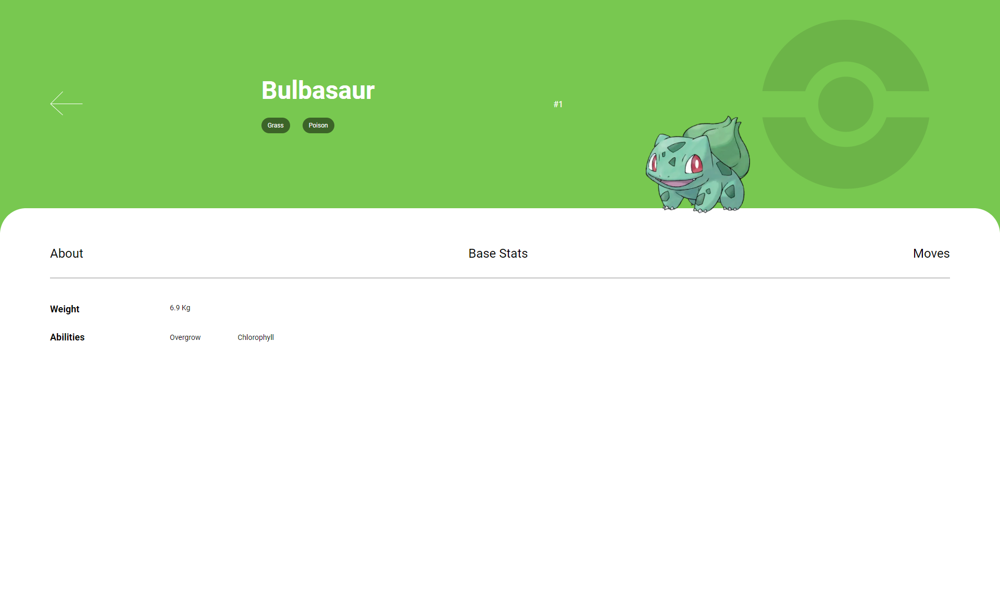

# Pokédex

O projeto é uma pokédex dos 151 primeiros pokemons, [layout](https://www.figma.com/file/TEW5aRbdelOXtPJCHgekfF/pokedex?node-id=0%3A1) inspirado por [Saepul Nahwan](https://dribbble.com/shots/6540871-Pokedex-App). Fazendo requisição a [API](https://pokeapi.co/), utilizando do recurso do NextJS de Static Site Generation para a parte de SEO e melhorando a performance na parte do cliente.

## **:computer: TECNOLOGIAS**

  - [NextJS](https://nextjs.org/)
  - [Typescript](https://www.typescriptlang.org/)
  - [Styled Components](https://styled-components.com/)
  - [Framer Motion](https://www.framer.com/motion/)
  - [Axios](https://github.com/axios/axios)
  - [SWR](https://swr.vercel.app/)

## **:camera: Screenshots**

* Home

* Scroll Infinito

* Busca

* Detalhes

